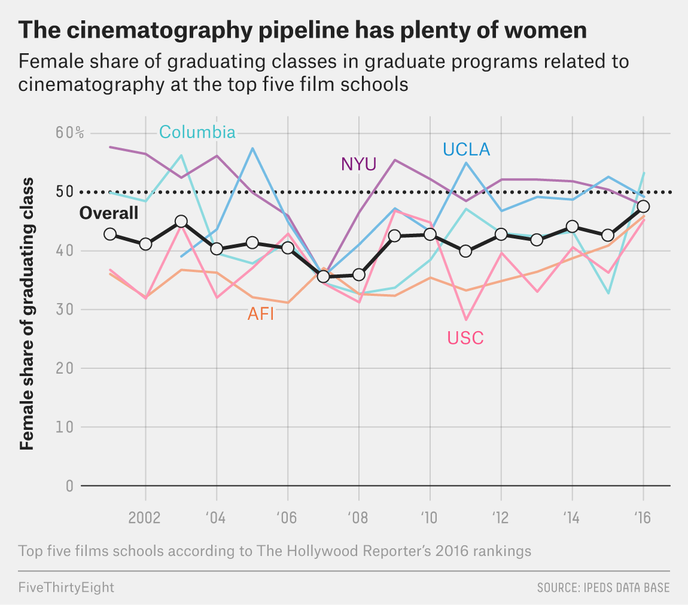
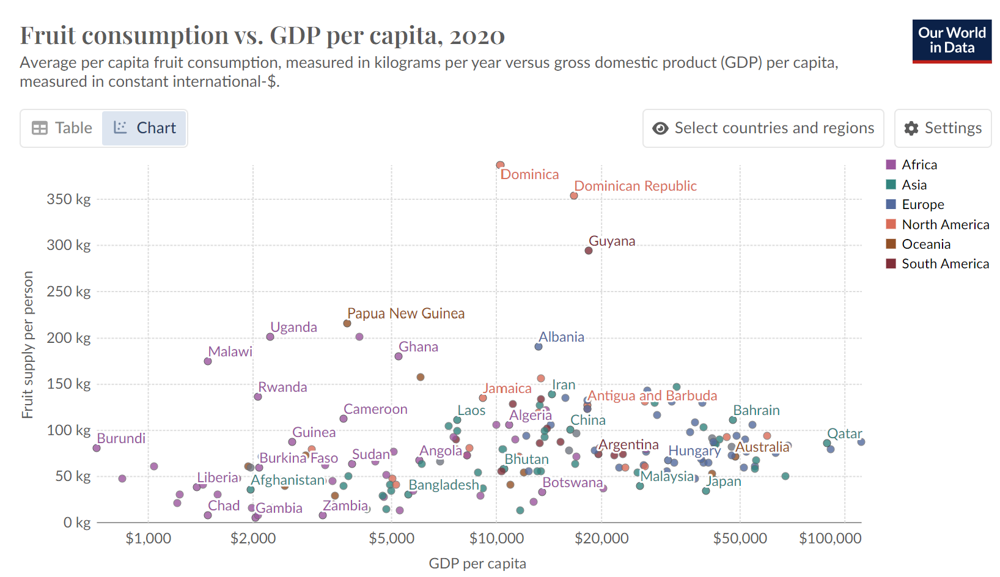
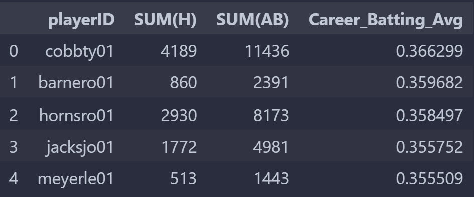
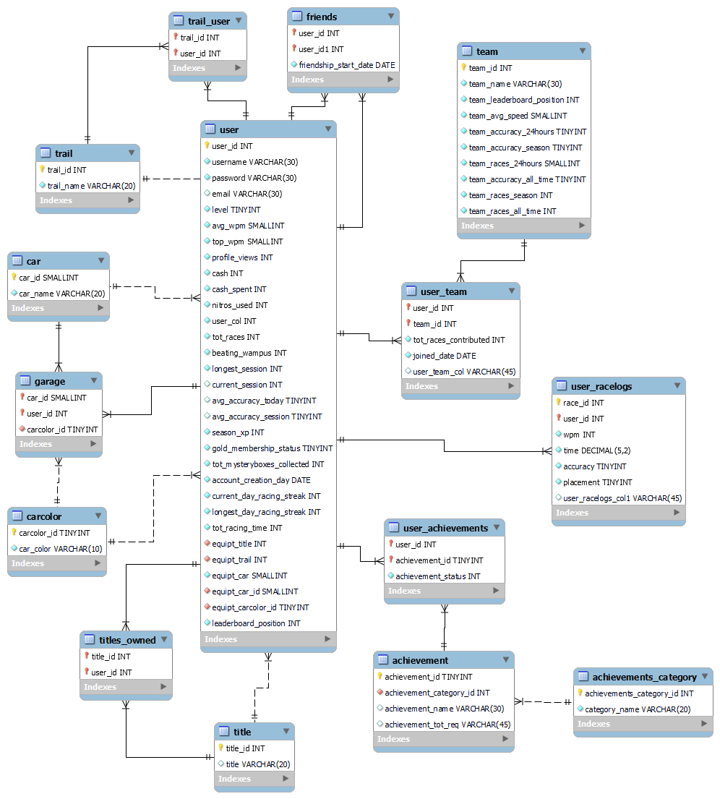

<!--
Future Improvement List
- Add TABLE OF CONTENTS sections at the beginning of sections that need it
- Add a few grids to display images side by side, or text along side images
  - Battleship Picture intro (put text on the side)
  - Both "Mimic" recreations
    - Tabset the two mimics so they can be clicked between
- Add SQL
- Add in rest of Statistical Analyses (Kruskal, Chi...)
- Add RNN
- Change the recreation for FruitVsGDP graph to be interactive
- Mess around with custom themes (HTML/CSS or libraries)
- Add more Linear Regressions
- Add a table of contents in the beginning hyperlinking to certain studies or intriguing questions I have answered with data / analysis.
- Add geospatial graphs
- Add interactive graphs
- Include Python Hobby work (TerrariaStyle game / diep.io)
-->

```{r message=FALSE, warning=FALSE, echo=F}
library(tidyverse)
library(mosaic)
library(car)
library(pander)
library(readxl)
library(haven)
knitr::opts_chunk$set(echo = TRUE, message = FALSE, warning = FALSE, error = TRUE)
```

```{python, echo=F}
import pandas as pd
import numpy as np
import altair as alt
import seaborn as sns
```

# HELLO! WELCOME TO MY PORTFOLIO!

:::: {style="display: grid; grid-template-columns: 1fr 1fr; grid-column-gap: 10px;"}

::: {}

:::

::: {}

:::

::::


<!-- NAVIGATION GRID -->

:::: {style="display: grid; grid-template-columns: 1fr 1fr; grid-column-gap: 10px; text-align: center; padding=30px; background-color: rgb(245, 240, 240);"}

::: {style="margin: 20px 10px 10px 20px; padding: 20px; background-color: rgb(230, 225, 225);"}
#### Data Wrangling and Visualization
<div style="text-align: left; text-indent: 20px">
I am adept with R(tidyverse) and Python(pandas and seaborn) for data wrangling and visualization.
</div>
:::


::: {style="margin: 20px 20px 10px 10px; padding: 20px; background-color: rgb(230, 225, 225);"}
#### Statistical Analysis
<div style="text-align: left; text-indent: 20px">
I can create interpretable multiple linear regression models, as well as perform many other statistical tests.
</div>
:::

::: {style="margin: 10px 10px 20px 20px; padding: 20px; background-color: rgb(230, 225, 225);"}
#### SQL
<div style="text-align: left; text-indent: 20px">
Comfortable querying large databases. Familiar with database design.
</div>
:::

::: {style="margin: 10px 20px 20px 10px; padding: 20px; background-color: rgb(230, 225, 225);"}
#### Machine Learning
<div style="text-align: left; text-indent: 20px">
Familiar with Neural Networks (including CNN and RNN). Comfortable with XGBoost, RandomForest, Descision Trees, and Gradient Boosted Models. Very comfortable with all supervised learning.
</div>
:::

::::


<!--BATTLESHIP

:::: {style="display: grid; grid-template-columns: 1fr 0.5fr; grid-column-gap: 10px; align-items: center;text-indent: 20px;"}

::: {}
```{r, label="Battleship"}
df <- read_csv("LinearRegression/Battleship/ThereIsChaosInTheOrder.csv") |>
  mutate(
    switches = x2 + x4 + x5 + x9 + x10,
    mainX = x1 + x6 + x8,
    lineInt = x1 * x6 * x8,
    green = ifelse(switches == 0, 1, 0),
    blue = ifelse(switches == 1, 1, 0),
    orange = ifelse(switches == 2, 1, 0),
    purple = ifelse(switches == 3, 1, 0),
    red = ifelse(switches == 4, 1, 0),
    black = ifelse(switches == 5, 1, 0),
  )

mylm <- lm(y~green:I(mainX^5):lineInt + green:I(mainX^4):lineInt
          + green:I(mainX^3):lineInt + green:I(mainX^2):lineInt
          + green:I(mainX):lineInt + green:lineInt +
          blue:mainX:lineInt +
          purple:I(mainX^3):lineInt +
          orange:I(x7) + orange:mainX:lineInt +
          red:I(mainX^5):lineInt + red:I(mainX^4):lineInt + red:I(mainX^3):lineInt +
          black:lineInt+black:mainX, data=df)

b <- coef(mylm)

ggplot(df, aes(x = mainX, y = y)) +
  geom_point(aes(color = as.factor(switches)), size=2) +
  # GREEN
  stat_function(fun = function(x) 0.1782962 +
                  beta5 * x^5 +
                  beta4 * x^4 +
                  beta3 * x^3 +
                  beta2 * x^2 +
                  beta1 * x +
                  beta0,
                alpha = 0.2,
                color = "forestgreen",
                aes(color="1")) +
  stat_function(fun = function(x) 0.1782962 +
                  beta5 * x^5 * 7 +
                  beta4 * x^4 * 7 +
                  beta3 * x^3 * 7 +
                  beta2 * x^2 * 7 +
                  beta1 * x * 7 +
                  beta0 * 7,
                alpha = 0.2,
                color = "forestgreen",
                aes(color="1")) +
  stat_function(fun = function(x) 0.1782962 +
                  beta5 * x^5 * 2 +
                  beta4 * x^4 * 2 +
                  beta3 * x^3 * 2 +
                  beta2 * x^2 * 2 +
                  beta1 * x * 2 +
                  beta0 * 2,
                alpha = 0.2,
                color = "forestgreen",
                aes(color="1")) +
  stat_function(fun = function(x) 0.1782962 +
                  beta5 * x^5 * 0.4 +
                  beta4 * x^4 * 0.4 +
                  beta3 * x^3 * 0.4 +
                  beta2 * x^2 * 0.4 +
                  beta1 * x * 0.4 +
                  beta0 * 0.4,
                alpha = 0.2,
                color = "forestgreen",
                aes(color="1")) +
  stat_function(fun = function(x) 0.1782962 +
                  beta5 * x^5 * 0.5 +
                  beta4 * x^4 * 0.5 +
                  beta3 * x^3 * 0.5 +
                  beta2 * x^2 * 0.5 +
                  beta1 * x * 0.5 +
                  beta0 * 0.5,
                alpha = 0.2,
                color = "forestgreen",
                aes(color="1")) +
  # BLUE
  stat_function(fun = function(x) 0.1782962 +
                  beta6 * x * 1,
                alpha = 0.2,
                color = "skyblue3",
                aes(color="2")) +
  stat_function(fun = function(x) 0.1782962 +
                  beta6 * x * 1.45,
                alpha = 0.2,
                color = "skyblue3",
                aes(color="2")) +
  stat_function(fun = function(x) 0.1782962 +
                  beta6 * x * 0.9,
                alpha = 0.2,
                color = "skyblue3",
                aes(color="2")) +
  stat_function(fun = function(x) 0.1782962 +
                  beta6 * x * 2,
                alpha = 0.2,
                color = "skyblue3",
                aes(color="2")) +
  stat_function(fun = function(x) 0.1782962 +
                  beta6 * x * 2.5,
                alpha = 0.2,
                color = "skyblue3",
                aes(color="2")) +
  stat_function(fun = function(x) 0.1782962 +
                  beta8 * 1 + beta9 * x * 1,
                alpha = 0.2,
                color = "orange",
                aes(color="3")) +
  stat_function(fun = function(x) 0.1782962 +
                  beta8 * 1.34 + beta9 * x * -1,
                alpha = 0.2,
                color = "orange",
                aes(color="3")) +
  stat_function(fun = function(x) 0.1782962 +
                  beta8 * 0.5 + beta9 * x * 1,
                alpha = 0.2,
                color = "orange",
                aes(color="3")) +
  stat_function(fun = function(x) 0.1782962 +
                  beta8 * 0.8 + beta9 * x * -0.4,
                alpha = 0.2,
                color = "orange",
                aes(color="3")) +
  stat_function(fun = function(x) 0.1782962 +
                  beta8 * 1.25 + beta9 * x * -0.5,
                alpha = 0.2,
                color = "orange",
                aes(color="3")) +
  stat_function(fun = function(x) 0.1782962 +
                  beta8 * -0.2 + beta9 * x * 1.6,
                alpha = 0.2,
                color = "orange",
                aes(color="3")) +
  stat_function(fun = function(x) 0.1782962 +
                  beta8 * 0.18 + beta9 * x * 2.9,
                alpha = 0.2,
                color = "orange",
                aes(color="3")) +
  stat_function(fun = function(x) 0.1782962 +
                  beta8 * 0.4 + beta9 * x * 1.2,
                alpha = 0.2,
                color = "orange",
                aes(color="3")) +
  stat_function(fun = function(x) 0.1782962 +
                beta8 * 0.4 + beta9 * x * 1.2,
              alpha = 0.2,
              color = "orange",
              aes(color="3")) +
  stat_function(fun = function(x) 0.1782962 +
                  beta7 * x^3 * 1,
                alpha = 0.2,
                color = "purple",
                aes(color="4")) +
  stat_function(fun = function(x) 0.1782962 +
                  beta7 * x^3 * 0.5,
                alpha = 0.2,
                color = "purple",
                aes(color="4")) +
  stat_function(fun = function(x) 0.1782962 +
                  beta7 * x^3 * 2,
                alpha = 0.2,
                color = "purple",
                aes(color="4")) +
  stat_function(fun = function(x) 0.1782962 +
                  beta7 * x^3 * 3,
                alpha = 0.2,
                color = "purple",
                aes(color="4")) +
  stat_function(fun = function(x) 0.1782962 +
                  (beta12 * x^5 + beta11 * x^4 + beta10 * x^3) * 1,
                alpha = 0.2,
                color = "red",
                aes(color="5")) +
  stat_function(fun = function(x) 0.1782962 +
                  (beta12 * x^5 + beta11 * x^4 + beta10 * x^3) * 6,
                alpha = 0.2,
                color = "red",
                aes(color="5")) +
  stat_function(fun = function(x) 0.1782962 +
                  (beta12 * x^5 + beta11 * x^4 + beta10 * x^3) * 2.5,
                alpha = 0.2,
                color = "red",
                aes(color="5")) +
  stat_function(fun = function(x) 0.1782962 +
                  (beta12 * x^5 + beta11 * x^4 + beta10 * x^3) * 4,
                alpha = 0.2,
                color = "red",
                aes(color="5")) +
  stat_function(fun = function(x) 0.1782962 +
                  (beta12 * x^5 + beta11 * x^4 + beta10 * x^3) * 80,
                alpha = 0.2,
                color = "red",
                aes(color="5")) +
  stat_function(fun = function(x) 0.1782962 +
                  (beta12 * x^5 + beta11 * x^4 + beta10 * x^3) * 0.014,
                alpha = 0.2,
                color = "red",
                aes(color="5")) +
  stat_function(fun = function(x) 0.1782962 +
                  (beta12 * x^5 + beta11 * x^4 + beta10 * x^3) * 0.018,
                alpha = 0.2,
                color = "red",
                aes(color="5")) +
  stat_function(fun = function(x) 0.1782962 +
                  (beta12 * x^5 + beta11 * x^4 + beta10 * x^3) * 0.0087,
                alpha = 0.2,
                color = "red",
                aes(color="5")) +
  stat_function(fun = function(x) 0.1782962 +
                  (beta12 * x^5 + beta11 * x^4 + beta10 * x^3) * 0.0067,
                alpha = 0.2,
                color = "red",
                aes(color="5")) +
  stat_function(fun = function(x) 0.1782962 +
                  (beta12 * x^5 + beta11 * x^4 + beta10 * x^3) * 0.0022,
                alpha = 0.2,
                color = "red",
                aes(color="5")) +
stat_function(fun = function(x) 0.1782962 +
                  beta13 * 1 + beta14 * x,
                alpha = 0.2,
                color = "gray50",
                aes(color = "6")) +
  stat_function(fun = function(x) 0.1782962 +
                  beta13 * 1.3 + beta14 * x,
                alpha = 0.2,
                color = "gray50",
                aes(color = "6")) +
  stat_function(fun = function(x) 0.1782962 +
                  beta13 * 1.47 + beta14 * x,
                alpha = 0.2,
                color = "gray50",
                aes(color = "6")) +
  stat_function(fun = function(x) 0.1782962 +
                  beta13 * 1.54 + beta14 * x,
                alpha = 0.2,
                color = "gray50",
                aes(color = "6")) +
  stat_function(fun = function(x) 0.1782962 +
                  beta13 * 1.65 + beta14 * x,
                alpha = 0.2,
                color = "gray50",
                aes(color = "6")) +
  stat_function(fun = function(x) 0.1782962 +
                  beta13 * 1.8 + beta14 * x,
                alpha = 0.2,
                color = "gray50",
                aes(color = "6")) +
  stat_function(fun = function(x) 0.1782962 +
                  beta13 * 0.7 + beta14 * x,
                alpha = 0.2,
                color = "gray50",
                aes(color = "6")) +
  stat_function(fun = function(x) 0.1782962 +
                  beta13 * 1.9 + beta14 * x,
                alpha = 0.2,
                color = "gray50",
                aes(color = "6")) +
  stat_function(fun = function(x) 0.1782962 +
                  beta13 * 2.35 + beta14 * x,
                alpha = 0.2,
                color = "gray50",
                aes(color = "6")) +
  stat_function(fun = function(x) 0.1782962 +
                  beta13 * 2.32 + beta14 * x,
                alpha = 0.2,
                color = "gray50",
                aes(color = "6")) +
  # GREEN
  stat_function(fun = function(x) b[1] +
                  b[6] * x^5 +
                  b[7] * x^4 +
                  b[8] * x^3 +
                  b[9] * x^2 +
                  b[10] * x +
                  b[2],
                alpha = 0.2,
                color = "forestgreen",
                aes(color = "1"), linetype = "dashed") +
  stat_function(fun = function(x) b[1] +
                  b[6] * x^5 * 7 +
                  b[7] * x^4 * 7 +
                  b[8] * x^3 * 7 +
                  b[9] * x^2 * 7 +
                  b[10] * x * 7 +
                  b[2] * 7,
                alpha = 0.2,
                color = "forestgreen",
                aes(color = "1"), linetype = "dashed") +
  stat_function(fun = function(x) b[1] +
                  b[6] * x^5 * 2 +
                  b[7] * x^4 * 2 +
                  b[8] * x^3 * 2 +
                  b[9] * x^2 * 2 +
                  b[10] * x * 2 +
                  b[2] * 2,
                alpha = 0.2,
                color = "forestgreen",
                aes(color = "1"), linetype = "dashed") +
  stat_function(fun = function(x) b[1] +
                  b[6] * x^5 * 0.4 +
                  b[7] * x^4 * 0.4 +
                  b[8] * x^3 * 0.4 +
                  b[9] * x^2 * 0.4 +
                  b[10] * x * 0.4 +
                  b[2] * 0.4,
                alpha = 0.2,
                color = "forestgreen",
                aes(color = "1"), linetype = "dashed") +
  stat_function(fun = function(x) b[1] +
                  b[6] * x^5 * 0.5 +
                  b[7] * x^4 * 0.5 +
                  b[8] * x^3 * 0.5 +
                  b[9] * x^2 * 0.5 +
                  b[10] * x * 0.5 +
                  b[2] * 0.5,
                alpha = 0.2,
                color = "forestgreen",
                aes(color = "1"), linetype = "dashed") +
  # BLUE
  stat_function(fun = function(x) b[1] +
                  b[11] * x * 1,
                alpha = 0.2,
                color = "skyblue3",
                aes(color = "2"), linetype = "dashed") +
  stat_function(fun = function(x) b[1] +
                  b[11] * x * 1.45,
                alpha = 0.2,
                color = "skyblue3",
                aes(color = "2"), linetype = "dashed") +
  stat_function(fun = function(x) b[1] +
                  b[11] * x * 0.9,
                alpha = 0.2,
                color = "skyblue3",
                aes(color = "2"), linetype = "dashed") +
  stat_function(fun = function(x) b[1] +
                  b[11] * x * 2,
                alpha = 0.2,
                color = "skyblue3",
                aes(color = "2"), linetype = "dashed") +
  stat_function(fun = function(x) b[1] +
                  b[11] * x * 2.5,
                alpha = 0.2,
                color = "skyblue3",
                aes(color = "2"), linetype = "dashed") +
  # ORANGE
  stat_function(fun = function(x) b[1] +
                  b[3] * 1 + b[13] * x * 1,
                alpha = 0.2,
                color = "orange",
                aes(color = "3"), linetype = "dashed") +
  stat_function(fun = function(x) b[1] +
                  b[3] * 1.34 + b[13] * x * -1,
                alpha = 0.2,
                color = "orange",
                aes(color = "3"), linetype = "dashed") +
  stat_function(fun = function(x) b[1] +
                  b[3] * 0.5 + b[13] * x * 1,
                alpha = 0.2,
                color = "orange",
                aes(color = "3"), linetype = "dashed") +
  stat_function(fun = function(x) b[1] +
                  b[3] * 0.8 + b[13] * x * -0.4,
                alpha = 0.2,
                color = "orange",
                aes(color = "3"), linetype = "dashed") +
  stat_function(fun = function(x) b[1] +
                  b[3] * 1.25 + b[13] * x * -0.5,
                alpha = 0.2,
                color = "orange",
                aes(color = "3"), linetype = "dashed") +
  stat_function(fun = function(x) b[1] +
                  b[3] * -0.2 + b[13] * x * 1.6,
                alpha = 0.2,
                color = "orange",
                aes(color = "3"), linetype = "dashed") +
  stat_function(fun = function(x) b[1] +
                  b[3] * 0.18 + b[13] * x * 2.9,
                alpha = 0.2,
                color = "orange",
                aes(color = "3"), linetype = "dashed") +
  stat_function(fun = function(x) b[1] +
                  b[3] * 0.4 + b[13] * x * 1.2,
                alpha = 0.2,
                color = "orange",
                aes(color = "3"), linetype = "dashed") +
  # PURPLE
  stat_function(fun = function(x) b[1] +
                  b[12] * x^3 * 1,
                alpha = 0.2,
                color = "purple",
                aes(color = "4"), linetype = "dashed") +
  stat_function(fun = function(x) b[1] +
                  b[12] * x^3 * 0.5,
                alpha = 0.2,
                color = "purple",
                aes(color = "4"), linetype = "dashed") +
  stat_function(fun = function(x) b[1] +
                  b[12] * x^3 * 2,
                alpha = 0.2,
                color = "purple",
                aes(color = "4"), linetype = "dashed") +
  stat_function(fun = function(x) b[1] +
                  b[12] * x^3 * 3,
                alpha = 0.2,
                color = "purple",
                aes(color = "4"), linetype = "dashed") +
  # RED
  stat_function(fun = function(x) b[1] +
                  (b[14] * x^5 + b[15] * x^4 + b[16] * x^3) * 1,
                alpha = 0.2,
                color = "red",
                aes(color = "5"), linetype = "dashed") +
  stat_function(fun = function(x) b[1] +
                  (b[14] * x^5 + b[15] * x^4 + b[16] * x^3) * 6,
                alpha = 0.2,
                color = "red",
                aes(color = "5"), linetype = "dashed") +
  stat_function(fun = function(x) b[1] +
                  (b[14] * x^5 + b[15] * x^4 + b[16] * x^3) * 2.5,
                alpha = 0.2,
                color = "red",
                aes(color = "5"), linetype = "dashed") +
  stat_function(fun = function(x) b[1] +
                  (b[14] * x^5 + b[15] * x^4 + b[16] * x^3) * 4,
                alpha = 0.2,
                color = "red",
                aes(color = "5"), linetype = "dashed") +
  stat_function(fun = function(x) b[1] +
                  (b[14] * x^5 + b[15] * x^4 + b[16] * x^3) * 80,
                alpha = 0.2,
                color = "red",
                aes(color = "5"), linetype = "dashed") +
  stat_function(fun = function(x) b[1] +
                  (b[14] * x^5 + b[15] * x^4 + b[16] * x^3) * 0.014,
                alpha = 0.2,
                color = "red",
                aes(color = "5"), linetype = "dashed") +
  stat_function(fun = function(x) b[1] +
                  (b[14] * x^5 + b[15] * x^4 + b[16] * x^3) * 0.018,
                alpha = 0.2,
                color = "red",
                aes(color = "5"), linetype = "dashed") +
  stat_function(fun = function(x) b[1] +
                  (b[14] * x^5 + b[15] * x^4 + b[16] * x^3) * 0.0087,
                alpha = 0.2,
                color = "red",
                aes(color = "5"), linetype = "dashed") +
  stat_function(fun = function(x) b[1] +
                  (b[14] * x^5 + b[15] * x^4 + b[16] * x^3) * 0.0067,
                alpha = 0.2,
                color = "red",
                aes(color = "5"), linetype = "dashed") +
    stat_function(fun = function(x) b[1] +
                  (b[14] * x^5 + b[15] * x^4 + b[16] * x^3) * 0.0022,
                alpha = 0.2,
                color = "red",
                aes(color = "5"), linetype = "dashed") +
  # GRAY
  stat_function(fun = function(x) b[1] +
                  b[4] * 1 + b[5] * x,
                alpha = 0.2,
                color = "gray50",
                aes(color = "6"), linetype = "dashed") +
  stat_function(fun = function(x) b[1] +
                  b[4] * 1.3 + b[5] * x,
                alpha = 0.2,
                color = "gray50",
                aes(color = "6"), linetype = "dashed") +
  stat_function(fun = function(x) b[1] +
                  b[4] * 1.47 + b[5] * x,
                alpha = 0.2,
                color = "gray50",
                aes(color = "6"), linetype = "dashed") +
  stat_function(fun = function(x) b[1] +
                  b[4] * 1.54 + b[5] * x,
                alpha = 0.2,
                color = "gray50",
                aes(color = "6"), linetype = "dashed") +
  stat_function(fun = function(x) b[1] +
                  b[4] * 1.65 + b[5] * x,
                alpha = 0.2,
                color = "gray50",
                aes(color = "6"), linetype = "dashed") +
  stat_function(fun = function(x) b[1] +
                  b[4] * 1.8 + b[5] * x,
                alpha = 0.2,
                color = "gray50",
                aes(color = "6"), linetype = "dashed") +
  stat_function(fun = function(x) b[1] +
                  b[4] * 0.7 + b[5] * x,
                alpha = 0.2,
                color = "gray50",
                aes(color = "6"), linetype = "dashed") +
  stat_function(fun = function(x) b[1] +
                  b[4] * 1.9 + b[5] * x,
                alpha = 0.2,
                color = "gray50",
                aes(color = "6"), linetype = "dashed") +
  stat_function(fun = function(x) b[1] +
                  b[4] * 2.35 + b[5] * x,
                alpha = 0.2,
                color = "gray50",
                aes(color = "6"), linetype = "dashed") +
  stat_function(fun = function(x) b[1] +
                  b[4] * 2.32 + b[5] * x,
                alpha = 0.2,
                color = "gray50",
                aes(color = "6"), linetype = "dashed") +
  scale_y_continuous(limits = c(0, 2.2)) +
  scale_color_manual(values = c("forestgreen", "skyblue3", "orange", "purple", "red", "gray50")) +
  labs(title='1st Place "Regression Battleship" Model',
       x="x",
       color="Switches") +
  theme_classic()
```
:::

::: {style="margin: 20px;"}
This graph represents my 1st place model for a class-wide competition in BYU-I's "Applied Linear Regression". In the end, it totaled 42 lines, and was labeled as "the most complex model I have ever seen" by my professor, Brother Saunders, a PhD Statistician. The "THX BS!" is a nod to him for his mentorship. For more information about Regression Battleship, [click here](LinearRegression/Battleship/RegressionBattleshipCreatingYourData.html))
:::

::::

-->

<hr>


### A couple things to note:

- All of the code used to generate each of these graphs can be made visible by clicking the small "Show" button on the right side of the screen above each visualization.
- Feel free to use the tabs on the left to navigate quickly to whatever intrigues you the most.
- Some visualizations have full analysis associated with them; click the links to see them if you are interested.


# 1. Data Wrangling and Visualization

## Tidyverse (R)
<!--
#### *ADD 2 MORE GRAPHS HERE OF MY OWN WORK*
-->

#### *Can I recreate professionals' visualizations?*

#### {.tabset .tabset-pills}

##### FiveThirtyEight

Recreating a graph from <b>[an article by fivethirtyeight](https://fivethirtyeight.com/features/women-in-cinematography-oscars/)</b>

:::: {style="display: grid; grid-template-columns: 1fr 1fr; grid-column-gap: 10px;"}

::: {}
My Recreation:

```{r, label="FiveThirtyEight", fig.height=6, fig.width=7}
df <- read_csv("https://github.com/ktoutloud/classslides/raw/master/math335/extra/women_film_data.csv") |> 
  filter(awlevel == "07") |> 
  mutate(school = case_when(
    school_id == 108870 ~ "AFI",
    school_id == 110662 ~ "UCLA",
    school_id == 123961 ~ "USC",
    school_id == 190150 ~ "Columbia",
    school_id == 193900 ~ "NYU"
  )) |> 
  group_by(sex, school, year) |> 
  summarise(
    count = sum(graduates)
  ) |> 
  pivot_wider(names_from = sex, values_from = count) |> 
  mutate(
    perc_female = female / (male + female) * 100
  )

overall <- df |> 
  group_by(year) |> 
  summarise(
    perc_female = sum(female) / (sum(male) + sum(female)) * 100
  ) |> 
  mutate(school = "Overall")

namelabels <- data.frame(
  school = c("AFI", "UCLA", "USC", "Columbia", "NYU", "Overall"),
  year   = c(2012,  2011,   2011,   2014     , 2017,  2011),
  perc_female = c(32, 58, 27, 57, 58, 45)
)

ggplot(df, aes(x=year, y=perc_female, group=school, color=school)) + 
  geom_hline(yintercept=50, linetype='dotted', size=1, show.legend=F) +
  geom_line(size=0.8, show.legend=F) +
  geom_line(data=overall, size=1, show.legend=F) +
  geom_point(data=overall,
             shape=21,
             fill="#F0F0F0",
             color='#232323',
             size=4,
             show.legend=F) +
  geom_text(data=namelabels, aes(label=school), show.legend=F) +
  geom_hline(yintercept=0, size=0.4) +
  scale_color_manual(values = c('AFI' = "#EBAA8A",
                                'UCLA' = "#96C6E7",
                                'USC' = "#F39BBA",
                                'Columbia' = "#9FDBE0",
                                'NYU' = "#B27CB4",
                                'Overall' = '#232323')) +
  scale_y_continuous(limits=c(0,60),
                     breaks = seq(0, 60, 10),
                     labels = c("0", "10", "20", "30", "40", "50", "60%")) +
  scale_x_continuous(breaks = seq(2010, 2018, 2),
                     labels = c("2010", "'12", "'14", "'16", "'18")) +
  labs(
    title="The cinematography pipeline has plenty of women",
    subtitle="Female share of graduating classes in graduate programs related to\ncinematography at top five film schools",
    y="Female share of graduating class",
    caption="Top five film schools according to The Hollywood Reporter's 2016 rankings"
  ) +
  ggthemes::theme_fivethirtyeight() +
  theme(
    axis.title.y = element_text(face="bold"),
    axis.text = element_text(color="#ADADAD"),
    axis.text.y = element_text(color=c('#ADADAD', '#ADADAD', '#ADADAD', '#ADADAD', '#ADADAD', '#232323', '#ADADAD'))
  )
```
:::

::: {}
[The Original](https://fivethirtyeight.com/wp-content/uploads/2018/03/hickey-cinematography-1.png):

<br>


:::

::::

The data used for the recreation was slightly different, hence the difference in years on the x-axis.


##### Our World In Data

Recreating a visualization from <b>[Our World in Data](https://ourworldindata.org/grapher/fruit-consumption-vs-gdp-per-capita?time=latest)</b>

:::: {style="display: grid; grid-template-columns: 1fr 1fr; grid-column-gap: 10px;"}

::: {}
```{r, label="OurWorldInData", fig.height=4.5, fig.width=8}
fruit <- read_csv("DataWranglingAndVisualization/Mimic/fruit.csv")
colnames(fruit) <- c('Entity', 'Code', 'Year', 'Fruit', 'GDP', 'Continent')

continent <- fruit %>% 
  filter(!is.na(Code)) %>% 
  group_by(Entity) %>% 
  fill(Continent, .direction='downup') %>% 
  ungroup()

year <- continent %>% 
  filter(Year == 2020)

country5 <- year %>% 
  filter(Entity %in% c('Dominica',
                       'Dominican Republic',
                       'Guyana',
                       'Albania',
                       'Papua New Guinea',
                       'Ghana'))

ggplot(year, aes(x=GDP, y=Fruit, color=Continent)) +
  geom_point(size=2, shape=1, color='gray70') +
  geom_point(alpha=0.85) + 
  scale_x_continuous(trans='log',
                     breaks=c(1000, 2000, 5000, 10000, 20000, 50000, 100000),
                     labels=c("$1,000", "$2,000", "$5,000", "$10,000", "$20,000", "$50,000", "$100,000")) +
  scale_y_continuous(limits = c(0,400),
                     expand = c(0,0),
                     breaks=seq(0, 350, 50),
                     labels=c('0 kg', '50 kg', '100 kg',
                              '150 kg', '200 kg', '250 kg',
                              '300 kg', '350 kg')) +
  scale_color_manual(values = c('Africa' = "#9B559D",
                                'Asia' = "#32847E",
                                'Europe' = "#536A9D",
                                'North America' = "#D96C58",
                                'Oceania' = "#925026",
                                'South America' = "#802F39"))+
  guides(color = guide_legend(override.aes = list(shape=15, alpha=1,size=3),
                              keyheight = 0.9,
                              keywidth = 0)) +
  labs(title="Fruit consumption vs. GDP per capita,  2020",
       subtitle="Average per capita fruit consumption, measured in kilograms per year versus\ngross domestic product (GDP) per capita, measured in constant international-$",
       x="GDP per capita",
       y="Fruit supply per person") +
  theme_classic() +
  theme(
    panel.grid.major = element_line(linetype='dotted', color='gray70'),
    axis.line.y = element_blank(),
    axis.line.x = element_line(size=0.25),
    axis.ticks.y = element_blank(),
    axis.ticks.x = element_blank(),
    legend.title = element_blank(),
    legend.justification = c(1,1),
    axis.title.x = element_text(vjust=-1),
    axis.title.y = element_text(vjust=4)
  )
```
:::

::: {}
Original Graph:


:::

::::


## Pandas, Seaborn and Altair (Python)


Pandas is used for data wrangling, while Seaborn and Altair are both Python Visualization libraries.

### *Which airport is best?*

"Delay Rating" is the porportion of flights which are delayed multiplied by the average hours of delay

```{python, label="PythonFlights"}
flights = pd.read_json("https://github.com/byuidatascience/data4missing/raw/master/data-raw/flights_missing/flights_missing.json")

# WRANGLING - PANDAS

# Gets rid of characters and just leaves numbers
flights['num_of_delays_carrier'] = (
    flights['num_of_delays_carrier'].str.replace(r'\D', '', regex=True)
)
# Replaces blank strings, -999, and "n/a" with the actual NaN value
flights = (flights
    .replace(["", -999, "n/a"], np.nan)
    .replace(["Febuary"], "February")
)
# Fills NaN values in num_of_delays_late_aircraft with the mean of the column
mean_late_air = flights.num_of_delays_late_aircraft.mean()
flights.num_of_delays_late_aircraft.fillna(mean_late_air, inplace=True)
# Fills NaN values with the month before them
flights.month.ffill(inplace=True)


totals = (flights
 .groupby("airport_code")
 .agg(
     total_minutes_delayed = 
     ("minutes_delayed_total", np.sum),
     total_delays = 
     ("num_of_delays_total", np.sum),
     total_flights = 
     ("num_of_flights_total", np.sum),
).assign(
    total_hrs_delayed = lambda df: df.total_minutes_delayed / 60,
    ave_hrs_delayed = lambda df: df.total_hrs_delayed / df.total_delays,
    proportion_delayed = lambda df: df.total_delays / df.total_flights,
    delay_rating = lambda df: df.proportion_delayed * df.ave_hrs_delayed
).sort_values('delay_rating', ascending=False)
.reset_index()
)

# VISUALIZATION - ALTAIR
best_airport = alt.Chart(totals,
                         title= alt.Title(
                             "Airports Rated by Delay",
                             subtitle= "The higher the rating, the worse airport")).encode(
    x = alt.X('delay_rating:Q', title="Delay Rating"),
    y= alt.Y('airport_code:N', title="Airport Code", sort="-x"),
    color=alt.Color('airport_code:N', legend=None).scale(scheme="tealblues")
).mark_bar()
best_airport.save("Python/best_airport.html",embed_options={'width': 400})
```

<iframe src="Python/best_airport.html" width="500" height="250"></iframe>


DS250 2x
Machine Learning x2

# 2. Statistical Analysis

## Linear Regression

#### *When should I sell my Honda Accord?*

Or, which Honda Accord should I buy?
The "Buying Point" represents a Honda Accord for sale on [KSL](https://cars.ksl.com/) which, if bought and sold when reaching 75,000 miles, would allow you to drive it for 39,761 miles and gain $\approx 2$ cents per mile on its selling price. For more info [...click here to see the full analysis](LinearRegression/CarSellingPrice/CarSellingPrice.html)

```{r}
car_raw <- read_csv('LinearRegression/CarSellingPrice/Honda_Accord_Sales_Data.csv')
car <- car_raw |>
  mutate(
    Year = as.factor(Year),
    generation = case_when(
      Year %in% c(2013,2014,2015,2016,2017) ~ '2013-17',
      TRUE ~ '2018-22'
    ),
    Miles = Miles / 1000,
    Cost = Cost / 1000
  )

car.lm <- lm(log(Cost)~Miles, data=car)
b <- coef(car.lm)
mylm <- lm(Cost~Miles, data=car)
confintv <- exp(predict(car.lm, interval="confidence"))
predintv <- exp(predict(car.lm, interval="prediction"))

buy_point <- data.frame(Miles=35.239, Cost=14.971, generation='2013-17')
sell_point <- data.frame(Miles=75, Cost=15.83134, generation='2013-17')

ggplot(car, aes(x=Miles, y=Cost, color=generation)) +
  geom_ribbon(aes(ymin=confintv[,2], ymax=confintv[,3]),
              alpha=0.1, fill='skyblue', color='skyblue3') +
  geom_ribbon(aes(ymin=predintv[,2], ymax=predintv[,3]),
              alpha=0.1, fill='firebrick3', color='firebrick') +
  geom_point() +
  geom_text(aes(label='Selling Point, $15,831'),
            x=100, y=17, color='hotpink') +
  geom_text(aes(label='Buying Point, $14,971'),
            x=34, y=16, color='skyblue') +
  geom_segment(data=buy_point, xend=75, yend=15.83134) +
  geom_point(data=buy_point, size=3, color='skyblue2', ) +
  stat_function(fun=function(x) exp(b[1]+b[2]*x), aes(color='log(Cost)')) +
  geom_point(data=sell_point, size=3, color='hotpink') +
  theme_bw() +
  labs(
    title="Honda Accord Offers on KSL.com",
    y="Sales Price (in thousands of $)",
    x="Miles (in thousands of mi)"
  )
```


## Multiple Linear Regression
#### *What effects a house's price the most?*

This section only includes the information about the regression model. For further insights on which features of a house have the greatest impact on its price, refer to the "Interpreting the Model" section of the 
[complete analysis](LinearRegression/MultipleLR/HouseSellingPrices.html).

```{r,warning=F}
houses <- read.csv("LinearRegression/MultipleLR/train.csv", header=T, stringsAsFactors = T)
  
# NA fill "No ____"
correctNAlist <- c("Alley", "Fence", "PoolQC", "FireplaceQu",
                   "MiscFeature", "GarageQual",
                   "GarageCond","GarageFinish", "GarageType",
                   "BsmtQual", "BsmtCond", "BsmtExposure", "BsmtFinType1",
                   "BsmtFinType2", "MasVnrType")
for (item in correctNAlist) {
  houses <- houses |> 
    mutate(
      !!item := as.character(!!sym(item)),
      !!item := replace_na(!!sym(item), paste("No_", item)),
      !!item := as.factor(!!sym(item))
    )
}

# NA fill 0
fill_0 <- c("LotFrontage", "MasVnrArea")
for (item in fill_0) {
  houses <- houses |> 
    mutate(
      !!item := replace_na(!!sym(item), 0)
    )
}

houses <- houses |> 
  mutate(
    Electrical = replace_na(Electrical, "SBrkr"),
    GarageYrBlt = ifelse(GarageQual == "No_ GarageQual", 0, GarageYrBlt),
    TotalSF = TotalBsmtSF + X1stFlrSF + X2ndFlrSF,
    TotalSF = ifelse(TotalSF > 6000, mean(TotalSF), TotalSF),
    PercBsmtFin = (TotalBsmtSF - BsmtUnfSF) / BsmtUnfSF,
    PercBsmtFin = ifelse(is.na(PercBsmtFin) |
                           PercBsmtFin=="Inf", 0, PercBsmtFin),
    Has2nd = ifelse(X2ndFlrSF == 0, 1, 0),
    Has2nd = as.factor(Has2nd),
    HasBsmt = ifelse(TotalBsmtSF == 0, 1, 0),
    HasBsmt = as.factor(HasBsmt),
    BsmtExcellent = ifelse(BsmtQual == "Ex", 1, 0),
    GarageCar3 = ifelse(GarageCars == 3, 1, 0),
    #### BOOLEAN ####
      # 2nd Floor
    X2ndFlr = ifelse(X2ndFlrSF > 0, 1, 0),
    RichNeigh = case_when(
      Neighborhood %in% c("StoneBr","NridgHt","NoRidge") ~ 18.6342,
      Neighborhood %in% c("Blmngtn", "ClearCr", "CollgCr",
                          "Crawfor", "Gilbert", "NWAmes",
                          "SawyerW", "Somerst", "Timber", "Veenker") ~ 13.2532,
      T ~ 7.3327
    ),
    KitchenQ = case_when(
      KitchenQual == "Ex" ~ 3.28555,
      KitchenQual == "Gd" ~ -1.16439,
      KitchenQual == "TA" ~ -1.88592,
      KitchenQual == "Fa" ~ -2.22990,
    ),
    OverallQ = case_when(
      OverallQual == 1 ~ 0.4709,
      OverallQual == 2 ~ -5.5332,
      OverallQual == 3 ~ 18.5539,
      OverallQual == 4 ~ 28.4397,
      OverallQual == 5 ~ 34.9930,
      OverallQual == 6 ~ 43.1099,
      OverallQual == 7 ~ 53.9437,
      OverallQual == 8 ~ 65.5431,
      OverallQual == 9 ~ 82.3895,
      OverallQual == 10 ~ 93.5527
    ),
    customX = 42.872*(TotalSF) +
      9658.661*(KitchenQ) +
      1759.385*(OverallQ) +
      4113.104*(RichNeigh),
    megaSwitch = ifelse(MSZoning %in% c("RL", "FV", "RH"), 1, 0)
  )

set.seed(122)

num_rows <- 1000 #1460 total
keep <- sample(1:nrow(houses), num_rows)

train <- houses[keep, ] #Use this in the lm(..., data=mytrain)

test <- houses[-keep, ] #Use this in the predict(..., newdata=mytest)

final.lm <- lm(SalePrice~customX + customX:GarageCar3 + GarageCar3,data=train)

b <- coef(final.lm)

ggplot(train, aes(x=customX, y=SalePrice, color=as.factor(GarageCar3))) +
  geom_point(alpha=0.3) +
  scale_y_continuous(expand=c(0,0), limits = c(0, 630000), labels=c("$0", "$200k", "$400k", "600k")) +
  scale_x_continuous(labels=c("0", "100k", "200k", "300k", "400k", "500k")) +
  scale_color_manual(values = c("skyblue", "firebrick"), labels = c("No", "Yes")) +
  stat_function(fun=function(x) b[1] + b[2]*x, color="skyblue3") + 
  stat_function(fun=function(x) (b[1] + b[3]) + (b[2] + b[4])*x, color="firebrick3") + 
  labs(title="Can you Predict a House's Sale Price",
       subtitle="Just by knowing things about the house?",
       x="Custom X Variable",
       y="Sale Price ($)",
       color="Does the house have \n    a 3 car garage?") +
  theme_classic() +
  theme(
    panel.grid.major = element_line(color='gray95', linetype='dashed'),
    panel.grid.minor = element_line(color='gray95', linetype='dashed'),
    axis.line.y = element_line(color='gray90', linetype='dashed'),
    axis.ticks.y = element_blank()
  )
```

Here is the summary of the multiple linear regression:

```{r}
summary(final.lm) |> 
  pander()
```

After running the model on a validation set of data, the Adjusted R-squared only dropped by 0.04, showing that this model does work well at predicting new data. It should be noted that this model can predict within $60k of the actual sales price 95% of the time.

```{r}
y <- predict(final.lm, newdata=test)

ybar <- mean(test$SalePrice)

SSTO <- sum( (test$SalePrice - ybar)^2 )

# Compute SSE for each model using SalePrice - yhat
SSE <- sum( (test$SalePrice - y)^2 )

# Compute R-squared for each
rs <- 1 - SSE/SSTO


n <- length(test$SalePrice) #sample siz
p <- length(coef(final.lm))
rsa <- 1 - (n-1)/(n-p)*SSE/SSTO

my_output_table2 <- data.frame(Model = c("MyLM"), `Original R2` = c(summary(final.lm)$r.squared), `Orig. Adj. R-squared` = c(summary(final.lm)$adj.r.squared), `Validation R-squared` = c(rs), `Validation Adj. R^2` = c(rsa))

colnames(my_output_table2) <- c("Model", "Original $R^2$", "Original Adj. $R^2$", "Validation $R^2$", "Validation Adj. $R^2$")

knitr::kable(my_output_table2, escape=TRUE, digits=4)
```


## Other Statistical Methods

### {.tabset .tabset-pills}

#### T Test
##### *Do Men play video games more than Women?*

[...click here for full analysis](Analyses/TTest/HighSchoolSeniors.html)

```{r, label="TTest Graph"}
HSS <- read_csv("Analyses/TTest/HighSchoolSeniors.csv")
hist <- ggplot(HSS) +
  geom_histogram(
    aes(x=Video_Games_Hours,
        fill= Gender,
        color= Gender),
    alpha=0.2,
    position='identity'
    ) +
  theme_light() +
  labs(x="Average Hours of Video Games Played Per Week",
       y="Count")
box <- HSS |> 
  drop_na() |> 
ggplot(aes(y=Video_Games_Hours, x=Gender)) +
  geom_boxplot(aes(fill=Gender), color=rgb(0.2,0.2,0.2,0.7)) +
  theme_light() +
  labs(x="Gender",
       y="Average Hours of Video Games Played Per Week")
gridExtra::grid.arrange(hist, box, ncol=2, top = grid::textGrob("Male vs. Female Video Game Usage"))
```


```{r, label="TTest"}
t_test <- t.test(Video_Games_Hours ~ Gender, data=HSS, alternative="less") |> 
  pander()
```

Given our signifcant p-value, we can confidently state that men play significantly more video games than women.


<!--
#### Kruskal-Wallis Test
##### **

#### Chi-Squared Test
##### **
-->
#### ANOVA
##### *Does Music and/or Laptop Position affect Typing Speed?*

For more details, [view analysis](Analyses/ANOVA/MyTwoWayANOVA.html)

```{r, label="ANOVA Graph"}
typeSpeed <- read_csv("Analyses/ANOVA/type_data.csv")
stance <- ggplot(typeSpeed, aes(x= Stance, y= WPM)) +
  geom_boxplot(fill='lightgray', notch=TRUE) +
  geom_dotplot(aes(fill= Music), binaxis= 'y', stackdir= 'up',
               position=position_dodge(0.2),
               show.legend=F) +
  theme_light()
music <- ggplot(typeSpeed, aes(x= Music, y= WPM, fill= Music)) +
  geom_boxplot(fill='lightgray', notch=TRUE) +
  geom_dotplot(binaxis= 'y', stackdir= 'up',
               position=position_dodge(0.2)) +
  theme_light() +
  theme(legend.position=c(0.75,0.85))
gridExtra::grid.arrange(stance, music,
                       ncol=2,
                       top=grid::textGrob("Typing Speed Based on Laptop Position and Music"))
```

```{r, label="ANOVA Graph 2"}
ggplot(typeSpeed, aes(x=Music, y=WPM, group=Stance, color=Stance)) +
  geom_point(color='firebrick') +
  stat_summary(fun='mean', geom='line') +
  labs(title="Typing Speed Based on Non-Vocal(NV), Vocal(V), and No Music(None)",
       y="WPM",
       x="Type of Music") +
  theme_light()
```

```{r, label="ANOVA test"}
typeSpeed.aov <- aov(WPM ~ Music + Stance + Music:Stance, data=typeSpeed)
summary(typeSpeed.aov) %>% 
  pander()
```

Due to insignificant results, we cannot reject our null hypothesis that music and laptop position are not correlated to typing speed. However, it is interesting that a new typing speed record of 112 WPM was set when listening to non-vocal music while sitting on the floor with my laptop in my lap.


#### Wilcoxon Test
##### *What learning method leads to the best outcomes?*

3 learning methods were attempted in a recalling words test.The following graphic represents the distribution of the test results from each group.

For more results / interpretation: see the [full analysis](Analyses/Wilcoxon/RecallingWords.html)

```{r, label="Wilcoxon Graph"}
ggplot(Friendly, aes(
  x= condition,
  y= correct,
  fill= condition)) +
  geom_boxplot(fill= c('cyan3', 'cyan', 'gray'), color= 'black',
               notch=TRUE, width= 0.4) +
  geom_dotplot(binaxis= 'y', position= 'dodge', stackdir='center',
               binwidth = 0.5) +
  scale_fill_manual(values=c("cyan", "cyan3", "lightgray")) +
  labs(title="Recalling Words Test",
       x= "Testing Methods",
       y= "Final Score") +
  theme_light() +
  theme(legend.position= 'none')
```

```{r, label="Wilcoxon Test", warning= FALSE, comment= FALSE, error= FALSE}
wilcox.test(Friendly$correct[Friendly$condition == 'Meshed'], Friendly$correct[Friendly$condition == 'Before']) %>% 
  pander(caption="Wilcoxon rank some test with continuity correction (there are ties in the data)")
```

With a p-value greater than our significance level of $\alpha=0.05$, we fail to reject our null hypothesis, and continue to assume all three learning methods do not significantly differ in results. However, analyzing the box plots more, we can see that the "Before" and "Meshed" methods' boxplots' significance ranges are outside of that of the "SFR" method, telling us that they do differ.

Conclusion:
The "Before" or "Meshed" learning approaches should be used over the "SFR" method.


#### Logistic Regression {.active}
##### *Can you predict happiness?*

Using data from the GSS (General Social Survey), I created a model which predicted whether or not someone was happy based on a Happiness rating, which I derived from 11 of the survey questions involving physical and mental health, social relations, education, and religion. In [the analysis](Analyses/LogisticRegression/Consulting.html), I also ran a RandomForest ML model to predict one's happiness based on their survey answers with an 83% accuracy.

```{r}
gss2021 <- read_sas("Analyses/LogisticRegression/gss2021.sas7bdat", 
    NULL)

# Filter Data and Create Happy_Rating
mygss <- gss2021 %>% 
  select(c('HAPPY', 'HAPMAR','LIFE', 'SATSOC', 'HLTHMNTL', 'ACTSSOC', 'HEALTH', 'EMOPROBS', 'ATTEND', 'EDUC', 'RELACTIV', 'HLTHPHYS')) %>% 
  filter(!is.na(HAPPY)) %>% # Drop NA rows in the "HAPPY" column
  mutate( # Merge "Pretty Happy" and "Very Happy" columns to just be "Happy" ~ 1
    HAPPY = case_when(
      HAPPY %in% c(1,2) ~ 1,
      HAPPY %in% 3 ~ 0
    )
  ) %>% 
  mutate_all(~ifelse(is.na(.), mean(., na.rm = TRUE), .)) %>% # Fill NA with mean()
  mutate_all(~ . / max(.)) %>%  # Divide each column by its max value
  mutate( # Invert scale on questions that had inverse numbered answers
    ATTEND = ATTEND * -1 + 1,
    RELACTIV = RELACTIV * -1 + 1,
    EDUC = EDUC * -1 + 1,
  ) %>% 
  mutate( # Scale each factor to match its importance in the ML
    Happy_Rating = -100 * (EDUC * 0.15426218 +
                   ATTEND * 0.12488643 +
                   HAPMAR * 0.11542531 +
                   RELACTIV * 0.11377695 +
                   SATSOC * 0.08842675 +
                   EMOPROBS * 0.08201357 +
                   LIFE * 0.07298428 +
                   ACTSSOC * 0.06718067 +
                   HLTHMNTL * 0.06597608 +
                   HLTHPHYS * 0.06001798 +
                   HEALTH * 0.05504979) + 100, 
    Happy_Rating_Unscaled = -10 * (EDUC +
                   ATTEND + HAPMAR +
                   RELACTIV + SATSOC +
                   EMOPROBS + LIFE +
                   ACTSSOC + HLTHMNTL +
                   HLTHPHYS + HEALTH) + 100
  )

# Run Logistic Regression
gss.glm <- glm(HAPPY ~ Happy_Rating, data = mygss, family=binomial)

# Graph Logistic Regression
palette(c(rgb(1,0,0, alpha =0.05),rgb(0,0,1, alpha =0.05)))
plot(HAPPY ~ Happy_Rating, data = mygss, col=as.factor(HAPPY), pch=16, cex=2, xlab = "Happy Rating", ylab = "Are you Happy?", main = "Can You Predict Whether or not Someone is Happy?")
b <- coef(gss.glm)
curve(exp(b[1] +b[2]*x)/(1+exp(b[1] +b[2]*x)), add=TRUE)
legend(x=65, y=0.65, legend = c("Yes", "No"), col = c('blue', 'red'), pch = 16, title = "Are you Happy?")
```


<!--
# 3. SQL Querying
I have experience
-->


# 3. SQL

## Querying

### *Of all players with over 100 bats, who, of all baseball players, had the highest career batting average?*

Note: this table was generated in a python file in Visual Studio, and then copied over, due to the limitations of running python code in a RMD file along with other R code. However, the code used can still be seen by clicking "Show"

```{python}
import sqlite3

try:
  con = sqlite3.connect('lahmansbaseballdb.sqlite')
  
  batting_avg_career = pd.read_sql_query(
      """
      SELECT playerID, SUM(H), SUM(AB), 1.0*SUM(H) / SUM(AB) as Career_Batting_Avg
      FROM Batting
      GROUP BY playerID
      HAVING SUM(AB) >= 100
      ORDER BY Career_Batting_Avg DESC, playerID
      LIMIT 5
      """, con)
except:
  pass
```

{width="65%"}

I am comfortable with SQL querying.

## Database Design

I am familiar with MySQL and database design. I have not yet experienced uploading the format to a server and fully implementing it, but I do understand the principles of good database design; below is a database I made replicating that of what [nitrotype](https://www.nitrotype.com/), an online type racing game, would use.



# 4. Machine Learning

All of my Machine Learning experience has been in Python using the Tensorflow-Keras library. I am comfortable with:

- Decision Trees
- Random Forest
- Gradient Boost
- XGBoost
- Neural Networks
  - Typical "Feed-Forward" Network
  - Convolutional Neural Network (CNN)
    - Image Classification
  - Recurrent Neural Network (RNN)
    - Text Generation
    
Here are some examples of my work

## XGBoost

## NN

1-hour Coding Challenge:
Create a ML model to classify rice species:

[See code in Colab Notebook](https://colab.research.google.com/drive/1h_1KrSXrqNJDyNljDeOCQannQRjNpQVD#scrollTo=yq9LpSdq82x4)

Within the hour, I was able to:

- Create some basic data exploration visualizations
- Compare and contrast an XGBoost model and Neural Network on the data.
- Refine the Neural Network to an F1-score of 0.944.

My model was within the top 5 of the class.


## CNN - Image Recognition

Trained a CNN to classify 43 different types of street signs in Germany. This model performed with 96% accuracy on a holdout set of images, never before seen by the model.

[See code in Colab Notebook](https://colab.research.google.com/drive/1XXTgQaqdupCjPVCkBbdycCjFRuf9zNAp#scrollTo=CVSfaqgKPzE2)

<!--
## RNN - Text Generation
-->


